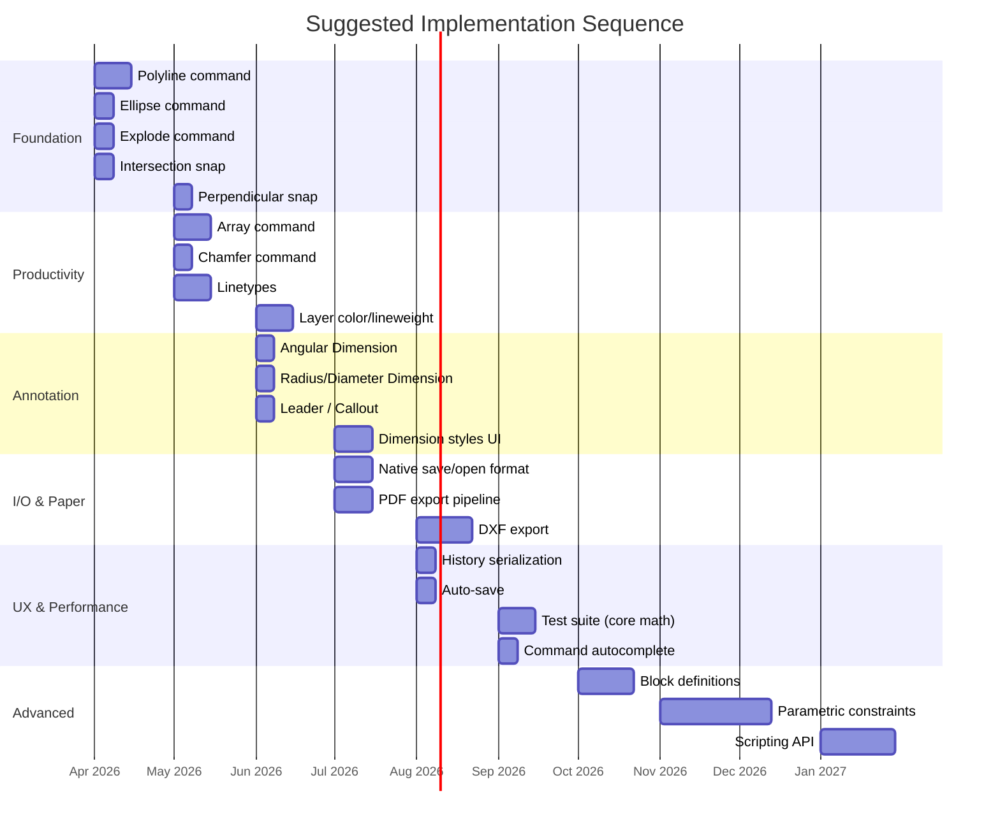

# Nanquim — Future Features Plan

A prioritized roadmap of feature suggestions for Nanquim, organized by theme and effort. Each section builds on the current codebase and aligns with the project's vision of a lightweight, browser-based 2D CAD tool.

---

## 1. Core Drawing & Editing Gaps

These are foundational CAD features that are either missing or partially implemented.

| Feature | Alias | Effort | Notes |
|---|---|---|---|
| **Polyline** (`PLINE`) | `pl` | Medium | Multi-segment line/arc entity stored as a single element. Enables closed shapes, area calculations, and is the backbone of most CAD workflows. |
| **Ellipse** | `el` | Low | Standard primitive. Support full ellipse and elliptical arc. |
| **Construction Line / Ray** | `xl` | Low | Infinite-length reference lines for alignment. Render only in viewport, excluded from exports. |
| **Chamfer** | `cha` | Medium | Counterpart to the existing Fillet command — creates angled cuts instead of arcs. |
| **Explode** | `x` | Low | Listed in [Roadmap.md](file:///home/indo/github/nanquim/Roadmap.md) but not yet implemented. Break groups/polylines/dimensions into primitive elements. |
| **Stretch** | [st](file:///home/indo/github/nanquim/src/js/History.js#3-249) | Medium | Partially move vertices of elements within a crossing selection window. |
| **Array** (Rectangular & Polar) | `ar` | Medium | Create repeated copies in grid or radial patterns — huge productivity booster. |
| **Break** | `br` | Medium | Split an element at one or two points, removing a segment. |
| **Join** | `j` | Low | Merge collinear lines or connected arcs into a single element. |

---

## 2. Snap & Precision Enhancements

The snap system ([snapSystem.js](file:///home/indo/github/nanquim/src/js/utils/snapSystem.js), 14 KB) already covers endpoint, midpoint, center, and quadrant. Several advanced modes are declared in [Editor.js](file:///home/indo/github/nanquim/src/js/Editor.js) but disabled (`false`).

| Feature | Priority | Notes |
|---|---|---|
| **Intersection snap** | High | Detect line-line, line-arc, arc-arc intersections. Uses existing [intersection.js](file:///home/indo/github/nanquim/src/js/utils/intersection.js) util. |
| **Perpendicular snap** | High | Snap to closest perpendicular foot on a target element. |
| **Tangent snap** | Medium | Snap to tangent point on arcs/circles from the current rubber-band direction. |
| **Extension snap** | Medium | Extend a line/arc beyond its endpoint virtually to find an alignment. |
| **Nearest snap** | Low | Snap to closest point on any element — useful as a fallback. |
| **Polar tracking angles config** | Low | UI to let users customize `polarAngles` array beyond the hardcoded 15°/30°/45° set. |
| **Grid snap** | Low | Force cursor to nearest grid intersection (toggle with `F7`). |
| **Object tracking** | Medium | Temporary alignment lines projected from previously acquired snap points. |

---

## 3. Layers & Organization

The current collection system works well. These additions make it production-grade.

| Feature | Effort | Notes |
|---|---|---|
| **Layer-based color/lineweight** | Medium | Set default stroke, color, and lineweight per collection. Elements set to "ByLayer" inherit these values. |
| **Linetypes** (dashed, dotted, center) | Medium | Define named linetype patterns, assignable per element or per layer. Render via SVG `stroke-dasharray`. |
| **Block / Symbol definitions** | High | Reusable component definitions inserted with `INSERT` command. Internally SVG `<use>` + `<defs>`. Critical for title blocks, symbols, repeated details. |
| **Block editor** | High | In-place editing of block definitions — changes propagate to all instances. |
| **Nested collections** | Low | Currently collections are flat. Allow sub-collections for deeper organization. |

---

## 4. Annotation & Dimensioning

Linear and Aligned dimensions already exist. Expand the annotation toolkit:

| Feature | Alias | Effort | Notes |
|---|---|---|---|
| **Angular Dimension** | `dan` | Medium | Measure angle between two lines or three points. |
| **Radius / Diameter Dimension** | `dr` / [dd](file:///home/indo/github/nanquim/src/js/Editor.js#132-139) | Medium | Attach to arcs/circles with proper leader and symbol. |
| **Leader / Callout** | [le](file:///home/indo/github/nanquim/src/js/Editor.js#132-139) | Medium | Arrow + multi-line text for notes. Support bent leaders. |
| **Multiline Text** (`MTEXT`) | `mt` | Medium | Rich text blocks with basic formatting (bold, newlines). |
| **Dimension styles** | — | Medium | [DimensionManager.js](file:///home/indo/github/nanquim/src/js/DimensionManager.js) exists; expose a UI for creating/editing named styles (text height, arrow type, precision, units). |
| **Area / Perimeter labels** | — | Low | Auto-calculated labels attached to closed polylines. |
| **Table object** | — | High | Spreadsheet-like grid for schedules and part lists. |

---

## 5. File I/O & Interoperability

| Feature | Effort | Notes |
|---|---|---|
| **Native save/open format** | Medium | Save the full project state (collections, paper config, dimension styles, history) as a JSON-enriched SVG or sidecar `.nanquim` file. Currently only raw SVG export exists. |
| **DXF export** | High | Currently only import is supported ([DXFloader.js](file:///home/indo/github/nanquim/src/js/utils/DXFloader.js)). Round-trip DXF is the #1 interoperability ask. Use the existing `vecks` dependency. |
| **PDF export** | Medium | `jspdf` and `svg2pdf.js` are already in [package.json](file:///home/indo/github/nanquim/package.json). Wire up the Paper Space export pipeline from [plans/paper-editor-implementation.md](file:///home/indo/github/nanquim/plans/paper-editor-implementation.md). |
| **PNG / raster export** | Low | Canvas-based rasterization for quick sharing. |
| **Auto-save / local storage** | Low | Periodic save to `localStorage` or IndexedDB to prevent data loss on tab close. |
| **Cloud storage** | High | Optional integration with Google Drive / Dropbox for save/open. Long-term. |

---

## 6. Paper Space (In Progress)

A detailed plan already exists in [paper-editor-implementation.md](file:///home/indo/github/nanquim/plans/paper-editor-implementation.md). Key remaining work:

- [ ] **Viewport scale locking** — prevent accidental pan/zoom inside locked viewports
- [ ] **Multiple page sheets** — support drawings with more than one sheet
- [ ] **Title block templates** — insertable predefined title blocks (A4, A3, A2…)
- [ ] **Print line weights** — map collection colors to pen widths for plotting
- [ ] **Color translation UI** — the `colorMap` field exists in `paperConfig` but has no UI

---

## 7. Selection & Interaction UX

| Feature | Effort | Notes |
|---|---|---|
| **Fence selection** | Low | Freehand polygon selection — select elements that cross the fence line. |
| **Select similar** | Low | Select all elements matching properties (type, color, layer) of the current selection. |
| **Quick select / filter** | Medium | Dialog to filter elements by type, layer, color, lineweight. |
| **Grip editing** | Medium | Click-and-drag element grips (vertices, midpoints, centers) without entering a command. Currently requires explicit handler editing. |
| **Double-click to edit** | Low | Double-click text → edit text; double-click dimension → edit value; double-click block → enter block editor. |
| **Context menu** | Low | Right-click menu with contextual actions (repeat last command, clipboard, properties). |

---

## 8. Performance & Architecture

| Feature | Effort | Notes |
|---|---|---|
| **History serialization** | Medium | [History.js](file:///home/indo/github/nanquim/src/js/History.js) has serialization code commented out. Enabling it allows persistent undo across sessions and crash recovery. |
| **Web Workers for heavy ops** | Medium | Offload intersection calculations, spatial index rebuilds, and PDF generation to workers. |
| **Virtual rendering** | High | Only render elements within the current viewport bounds. Critical for large drawings (10k+ elements). |
| **R-tree improvements** | Low | [r-tree-implementation.md](file:///home/indo/github/nanquim/r-tree-implementation.md) exists as a plan. Ensure [SpatialIndex.js](file:///home/indo/github/nanquim/src/js/SpatialIndex.js) indexes all element types and updates incrementally on edits. |
| **Test suite** | Medium | No automated tests exist. Add unit tests for math utils ([intersection.js](file:///home/indo/github/nanquim/src/js/utils/intersection.js), [arcUtils.js](file:///home/indo/github/nanquim/src/js/utils/arcUtils.js), [offsetCalc.js](file:///home/indo/github/nanquim/src/js/utils/offsetCalc.js)) and integration tests for commands. |

---

## 9. User Experience Polish

| Feature | Effort | Notes |
|---|---|---|
| **Keyboard shortcut customization** | Low | Let users remap command aliases and hotkeys. |
| **Command autocomplete** | Low | Terminal shows suggestions as the user types (fuzzy match against [_commands.js](file:///home/indo/github/nanquim/src/js/commands/_commands.js) registry). |
| **Minimap / navigator** | Medium | Small overview window showing the full drawing extent and the current viewport region. |
| **Dark/Light theme toggle** | Low | Currently dark. Add a light theme option via CSS custom properties. |
| **Touch / tablet support** | High | Gesture-based pan/zoom/draw for iPad and tablet browsers. |
| **Accessibility** | Medium | Keyboard navigation for UI panels, ARIA labels, screen reader support for outliner. |
| **Localization (i18n)** | Medium | Externalize UI strings for multi-language support. |
| **Onboarding / help** | Low | The [WelcomeScreen.js](file:///home/indo/github/nanquim/src/js/WelcomeScreen.js) exists. Add an interactive tutorial or command cheat-sheet overlay. |

---

## 10. Advanced / Long-Term Vision

These align with the README's dream of "this kind of editor inside Blender":

| Feature | Effort | Notes |
|---|---|---|
| **Parametric constraints** | Very High | Distance, angle, tangent, coincident constraints between elements. The foundation for parametric sketching. |
| **Scripting API** | High | Expose an API (JS console or plugin system) for users to automate tasks and create custom commands. |
| **Plugin architecture** | High | Let third-party developers register new commands, panels, and importers/exporters. |
| **Real-time collaboration** | Very High | Multi-user editing via WebSockets + CRDTs. |
| **Version control** | High | Track drawing revisions, diff, and merge. Leverage the SVG/JSON format. |
| **3D sketching bridge** | Very High | Export constrained 2D sketches as Blender-importable data (FreeCAD STEP, glTF annotations). The "Blender dream" path. |

---

## Suggested Priority Roadmap

> [!TIP]
> The items above are ordered to maximize user-visible impact early (drawing tools → precision → annotation → file I/O) while deferring high-risk, high-effort features (parametrics, collaboration) to later phases.

---

## Summary

Nanquim already has a solid foundation with 22 registered commands, a working outliner, snap system, spatial indexing, and early Paper Space support. The biggest gaps for a v1.0 release are:

1. **Polyline** — the single most impactful missing primitive
2. **Intersection & perpendicular snaps** — already stubbed, just need implementation
3. **Native project format** — prevent data loss of layer/dimension/paper settings
4. **DXF round-trip** — import exists, export is the missing half
5. **Linetypes & Layer defaults** — essential for professional-looking output
